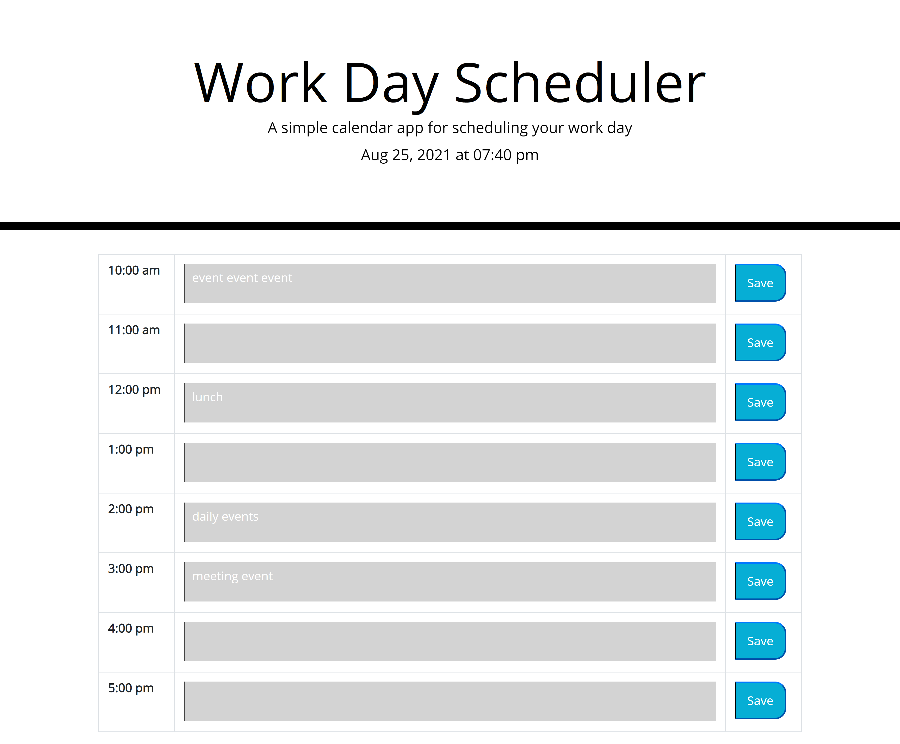

# Event-Calendar-05#
## Deployed Website
https://krysmit.github.io/Event-Calendar-05/
## GitHub Repository
https://github.com/krysmit/Event-Calendar-05

### Project Summary
This project is a daily calendar where hourly events can be logged. The color of each hour block changes depending on the time of day to que to user to upcoming events. The data stays displayed on the page even after being refreshed.

### Functions of this page that meet the critera:
* The date and time are displayed as you open the page.
* The standard business hours are displayed in blocks.
* Each timeblock is colord coded depending on the time of day.
* You can enter an event when you click on a timeblock, and this is saved to local storage.
* Events are still displayed after the page is refreshed.